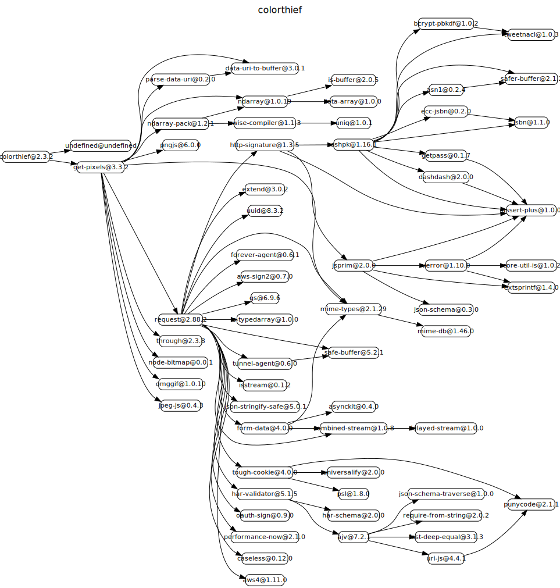
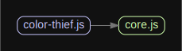

# 源码分析

## 文件结构

``` bash
/Users/liufang/openSource/FunnyLiu/color-thief
├── LICENSE
├── README.md
├── async.html
├── build
|  └── build.js
├── cypress
|  ├── fixtures
|  |  └── example.json
|  ├── integration
|  |  ├── api_spec.js
|  |  ├── cors_spec.js
|  |  └── module_spec.js
|  ├── plugins
|  |  └── index.js
|  ├── support
|  |  ├── commands.js
|  |  └── index.js
|  └── test-pages
|     ├── cors.html
|     ├── es6-module.html
|     ├── img
|     |  ├── black.png
|     |  ├── rainbow-horizontal.png
|     |  ├── rainbow-vertical.png
|     |  ├── red.png
|     |  ├── transparent.png
|     |  └── white.png
|     ├── index.html
|     ├── index.js
|     └── screen.css
├── cypress.json
├── dist
|  ├── color-thief.js
|  ├── color-thief.min.js
|  ├── color-thief.mjs
|  ├── color-thief.umd.js
|  └── color-thief.umd.js.map
├── examples
|  ├── css
|  |  └── screen.css
|  ├── img
|  |  ├── image-1.jpg
|  |  ├── image-2.jpg
|  |  └── image-3.jpg
|  └── js
|     └── demo.js
├── index.html
├── package-lock.json
├── package.json
└── src
|  ├── color-thief-node.js
|  ├── color-thief.js
|  └── core.js

directory: 14 file: 40

ignored: directory (1)

```

## 外部模块依赖



## 内部模块依赖


  